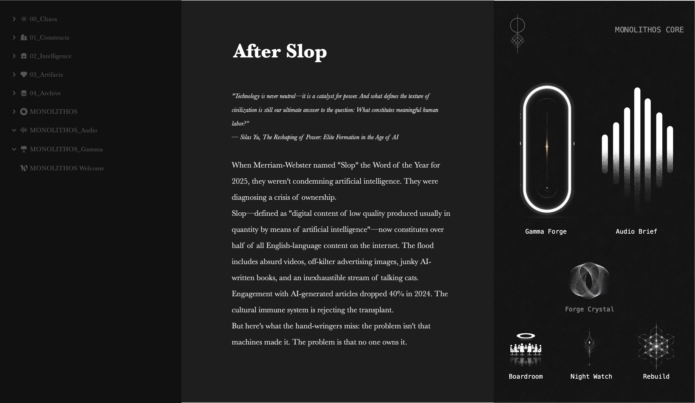
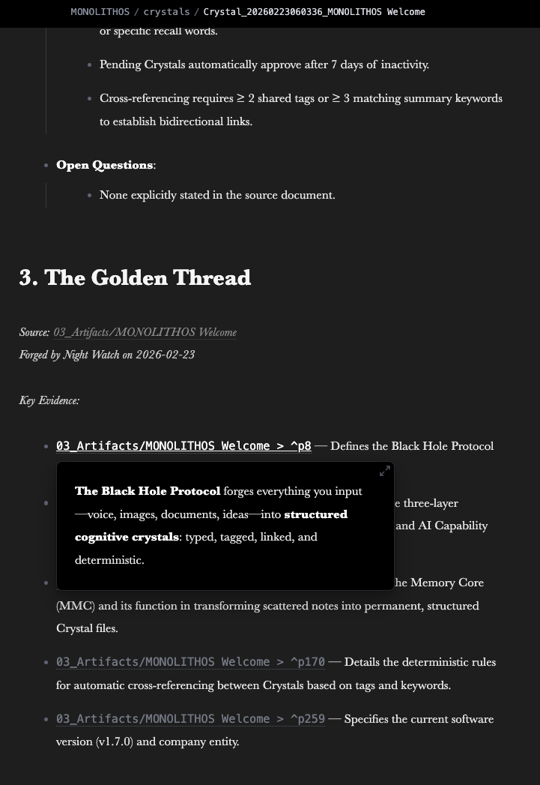
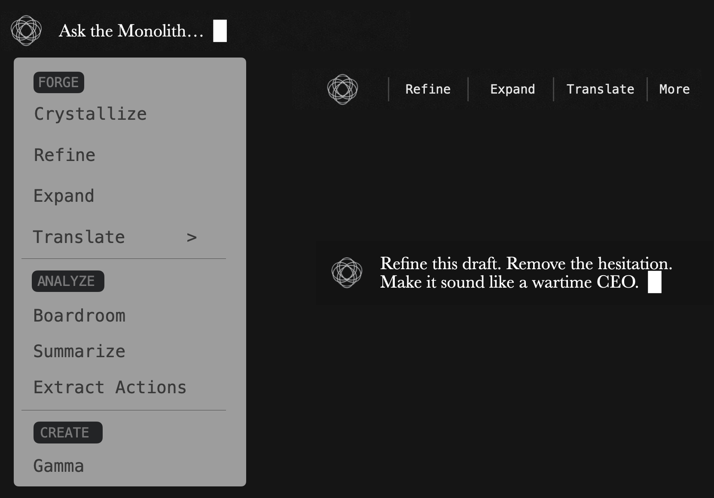
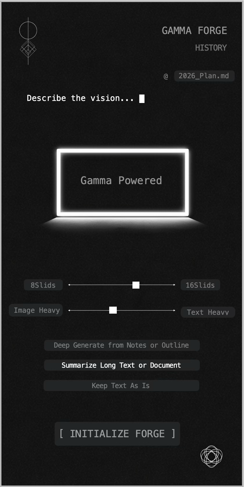
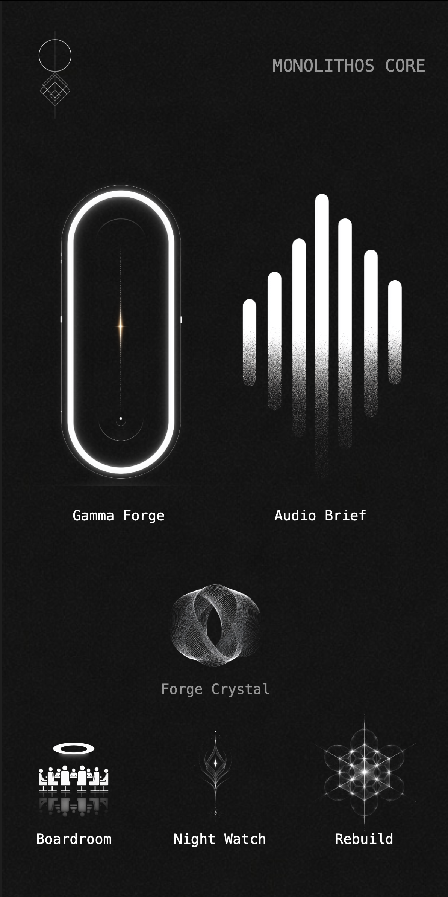
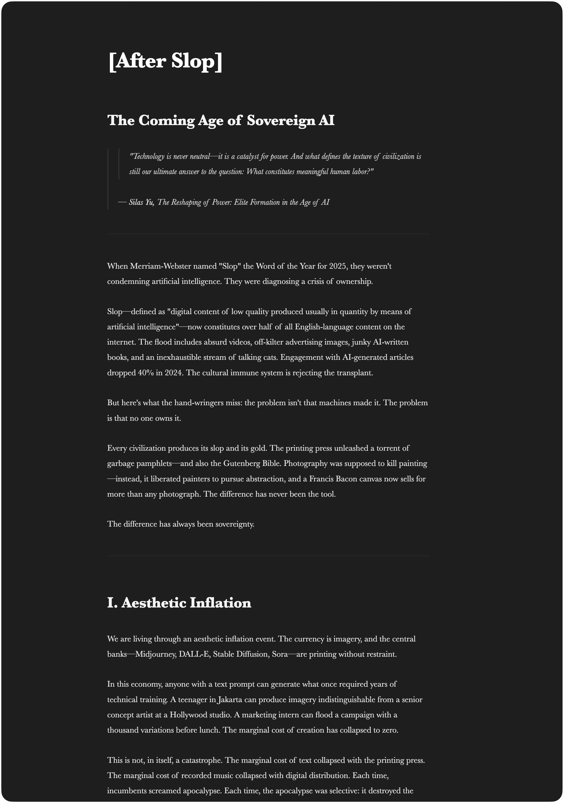
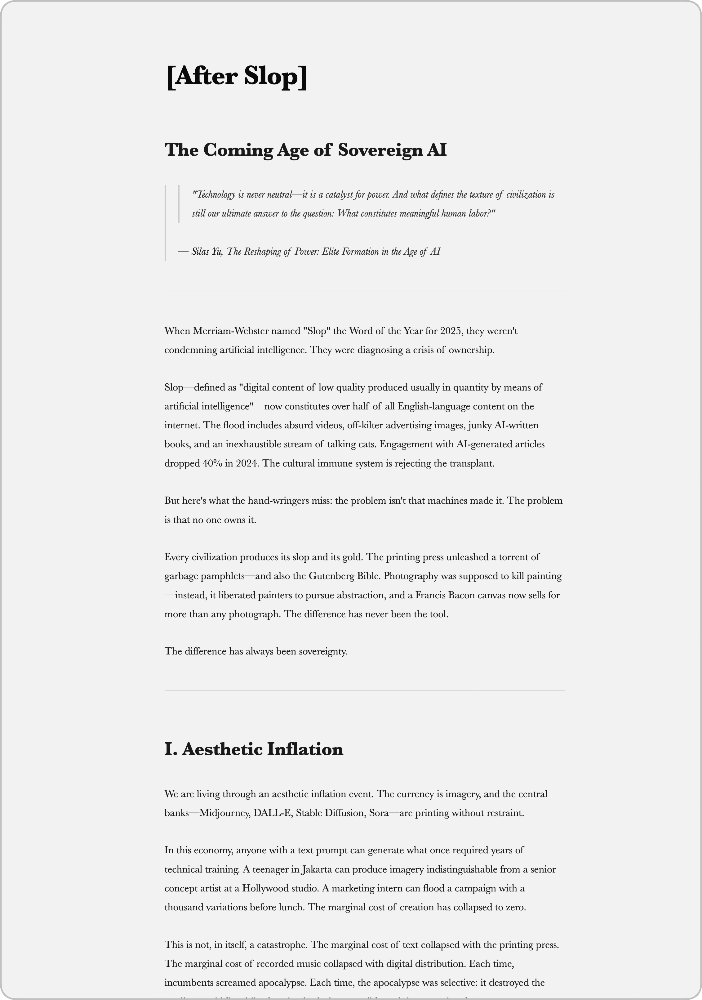

# MONOLITHOS

**Own Your Mind.**

A sovereign Life Operating System built on Obsidian. Your AI doesn't just generate — it remembers. Your data never leaves your machine.

> *Chaos is the fabric. Order is the cut.*

[](https://get.monolithos.ai)
[](https://monolithos.ai)

---

## What is Monolithos?

Monolithos is an AI-powered Life Operating System that runs entirely inside your Obsidian vault. It connects your local notes to the world's most powerful AI models — Claude 4.6, Grok, and Gemini 3.1 Pro — while keeping everything private, local-first, and under your control.

Every other AI tool forgets you the moment you close the window. Monolithos doesn't. It crystallizes your thinking into permanent cognitive assets, retrieves them when you need them, and traces every insight back to where it came from. Your vault stays on your machine. The AI comes to you.



## See it in action

| Memory Core & Crystallization | Chat & Synapse AI | Audio Brief & Gamma Forge |
|:----:|:----:|:----:|
| [▶ Watch](./assets/Readme_MMC.mov) | [▶ Watch](./assets/Readme_chat_Synapse.mov) | [▶ Watch](./assets/Readme_Audio_Gamma.mov) |

---

## Core Modules

### ⬡ Memory Core (MMC) — Your AI Has Been Forgetting You. We Fixed That.

**This is what makes Monolithos fundamentally different from every other AI plugin.**

Every AI assistant on the market operates the same way. Each session begins from zero. What they call "memory" is a statistical approximation — a guess about who you are, assembled from pattern matching, dissolving every time you close the tab.

MMC is the opposite architecture. When you think, it crystallizes. When you sleep, Night Watch runs. When you ask a question, it doesn't guess — it retrieves. Deterministic. Traceable. Yours.

#### Forge Crystal — One-Click Multimodal Crystallization

Open any note → click **Forge Crystal** in the Core panel → in 10-30 seconds, a new Crystal file appears.

Supports **multimodal crystallization**: notes, PDFs, documents, audio transcriptions, and images are all crystallized into structured cognitive assets.

Every Crystal contains:

- **Core Insight** — the distilled intelligence, compressed into a single actionable paragraph
- **Structured Data** — extracted entities, relationships, timestamps, and metadata
- **Golden Thread** — traceable `[[source_note#^p3]]` links pointing back to the exact source paragraph where each insight originated

Your original note receives a `crystallized` status and a backward link to its Crystal. Every piece of knowledge has a provenance chain. One click. Permanent.



#### Night Watch — Automated Batch Crystallization

While you sleep, it works.

Night Watch scans your vault on a schedule, crystallizes your unstructured notes in batch, and queues them for your review. Configure scan folders, set a time (e.g., 04:00), and let it run. You wake up with a more complete mind than when you closed your eyes.

You can also trigger batch crystallization manually from the Night Watch icon anytime.


#### Chat with Memory — Every Answer Cites Its Source

Your AI no longer guesses. It retrieves.

When you ask the Chat a question, the Memory Core surfaces relevant Crystals from your vault and injects them into context. The AI answers with knowledge of everything you've ever written — and every answer cites its source.

Crystal source links appear inline in the conversation: `Sources: [◇ Crystal_20260223...]`. **Hover any link** → a floating preview instantly shows the Crystal's Core Insight. **Click it** → the original note opens. From question to source paragraph, in one natural motion.


#### Memory Dashboard — Your Cognition, Made Visible

Every Crystal. Every connection. Every integrity score. A real-time mirror of your mind:

- **Metrics**: Total Crystals, Active Memory, Connections, Average Integrity Score
- **Crystallization Frequency**: When and how often your vault is being processed
- **AI Integrity Distribution**: Quality scores across all Crystals
- **Knowledge Topology**: Visual tag cloud showing the shape of your thinking across domains
- **Crystal Lifecycle**: Status tracking — Active, Pending, Archived, Rejected

This is not a productivity dashboard. This is a map of your cognitive territory.


---

### 💬 Chat — Multimodal AI Dialogue

Your private AI advisory council. Text, images, audio, video, PDFs — all understood natively.

Six intelligence modes from instant fluid responses to deep strategic reasoning. Reference any note in your vault with `@` mentions. Voice input built in.

**Getting started:** Open the Core panel → click the top-left icon to launch Chat. After your first session, you can switch back anytime via the 💬 icon in Obsidian's sidebar.


### 🔷 Synapse — In-Note AI Panel

AI operations that come to you. No view switching. No context loss.

**Two ways to summon:**
- **Select any text** → a floating mini bar appears with quick actions
- **Press `Cmd+J` without selection** → the full action menu opens at your cursor

**9 AI actions**: Crystallize, Refine, Expand, Translate, Boardroom, Summarize, Extract Actions, Delegate*, and Gamma. Plus a freeform text input — type anything and ask the AI directly.

Results stream into your document with a typewriter effect. Works on desktop and mobile (persistent keyboard toolbar on mobile).

*\*Delegate routes to Blackstone Direct Line — coming in a future update.*

| Desktop | Mobile |
|:----:|:----:|
|  |  |

---

### 🎙️ Audio Brief — Notes to Podcast

Transform any note into a professional dual-host podcast in 10 languages.

| Mode | Style |
|:-----|:------|
| **Deep Trace** | Intellectual detectives unraveling mysteries |
| **Boardroom** | HBO Succession-style power debate |
| **Roast** | Sharp-witted comedy dissection |
| **Briefing** | CIA morning brief — cold, precise |

One click. 2-5 minutes. Broadcast-quality audio from your own writing.


### 🎨 Gamma Forge — Notes to Presentation

Forge your notes into professional-grade presentations powered by a dual-AI pipeline.

Three modes: **Deep Generate** (AI extracts narrative structure), **Summarize** (condense to essentials), **Keep As Is** (preserve your structure). Adjustable slide count (8-16) and image ratio.



### 🕳️ Black Hole Protocol — Mobile Capture

Your iPhone becomes an event horizon. Photos, voice memos, screenshots, PDFs — captured, AI-analyzed, and crystallized into your vault via iOS Shortcut.

Share anything → AI processes it → structured note appears in Obsidian. 3-10 seconds.

### ⚙️ Core — Command Center

The nerve center of Monolithos. Six sovereign operations in two tiers:

| | | |
|:------|:------|:------|
| **Gamma Forge** | **Audio Brief** | **Forge Crystal** |
| Launch presentations | Launch podcasts | Crystallize active note |
| **Boardroom** | **Night Watch** | **Rebuild** |
| Shadow Board critique | Batch auto-crystallization | Enhanced note variant |



---

### 🎴 Dual-State Aesthetics

Writing as a ritual. Not a task.

We stripped away the interface to reveal the thought. In a world of cluttered toolbars and constant notifications, Monolithos offers **Digital Silence**. No distractions. No cloud latency. Just you, the blinking cursor, and the void.

Switch instantly between two modes:

| **Obsidian Noir** | **Concrete Mist** |
|:----:|:----:|
|  |  |
| Deep night work | Clarity in the light |

---

## Architecture

```
┌─────────────────────────────────────────────────────────┐
│   📱 BLACK HOLE PROTOCOL (iOS Shortcut)                  │
│   Voice / Image / Document → AI → Structured Note        │
└──────────────────────┬──────────────────────────────────┘
                       ▼
┌─────────────────────────────────────────────────────────┐
│   🖥️ YOUR OBSIDIAN VAULT (Local-First)                   │
│   All data stays on your machine                         │
└──────────────────────┬──────────────────────────────────┘
                       ▼
┌─────────────────────────────────────────────────────────┐
│   ⬡ MONOLITHOS PLUGIN                                    │
│   Chat │ Synapse │ Audio Brief │ Gamma Forge │ MMC       │
└──────────────────────┬──────────────────────────────────┘
                       │ HTTPS + Bearer Auth
                       ▼
┌─────────────────────────────────────────────────────────┐
│   MONOLITHOS BACKEND (Sovereign Infrastructure)          │
│   Claude 4.6 │ Grok │ Gemini 3.1 Pro Deep Think         │
└─────────────────────────────────────────────────────────┘
```

---

## Installation

### From Obsidian Community Plugins (Recommended)

1. Open Obsidian → Settings → Community Plugins
2. Click **Browse** → Search **"Monolithos"**
3. Click **Install** → **Enable**
4. Go to **Settings → Monolithos** → Enter your API Key
5. Done. Open the Core panel and begin.

### Via BRAT (Beta)

1. Install the [BRAT plugin](https://github.com/TfTHacker/obsidian42-brat)
2. Add beta plugin: `monolithos/monolithos-plugin`
3. Enable Monolithos in Community Plugins
4. Enter your API Key in Settings

### Get Your API Key

Visit **[get.monolithos.ai](https://get.monolithos.ai)** to register for a free 7-day trial. Full access. No credit card.

---

## Pricing

The Monolithos plugin is free to install. You pay only for AI compute.

| Plan | Price | What You Get |
|:-----|:------|:-------------|
| **Free Trial** | $0 / 7 days | Full access to every feature. No credit card required. |
| **Monthly** | $39/month | Unlimited AI compute. Claude 4.6, Grok, Gemini 3.1 Pro. Cancel anytime. |
| **Annual** | $349/year | Same power. Save $119. |
| **Founding Member** | $999 lifetime | 50 seats. All current and future features. Direct line to the architect. |

Daily trial limits: 20 chats · 3 crystallizations · 1 Audio Brief · 1 Gamma Forge

→ **[Start your free trial](https://get.monolithos.ai)**
→ **[View full pricing](https://monolithos.ai)**

---

## Platform Support

| Platform | Status |
|:---------|:-------|
| macOS | ✅ Full support |
| Windows | ✅ Full support |
| Linux | ✅ Full support |
| iOS | ✅ Full support (including Black Hole Protocol) |
| Android | ✅ Full support |

## Requirements

- [Obsidian](https://obsidian.md) v1.5.0 or later
- A Monolithos API Key ([get one free](https://get.monolithos.ai))
- Internet connection (for AI model access)

---

## Quick Start

1. **Install** the plugin and enter your API key in Settings
2. **Chat**: Core panel → top-left icon → start a conversation (then use sidebar 💬 to switch back)
3. **Synapse**: Select text → floating bar appears. Or `Cmd+J` for the full menu. Type freely to ask the AI anything
4. **Crystallize**: Core panel → Forge Crystal. Or click the Night Watch icon for batch processing
5. **Audio Brief**: Core panel → Audio Brief → choose mode → Transmit
6. **Gamma Forge**: Core panel → Gamma → describe your vision → Initialize Forge
7. **Black Hole**: Install the iOS Shortcut from [get.monolithos.ai](https://get.monolithos.ai) → Share anything → it lands in your vault

---

## Privacy & Security

- **Local-first**: Your vault stays on your device
- **No data storage**: AI requests are processed and discarded — nothing is stored server-side
- **No telemetry**: We don't track your usage, notes, or behavior
- **No third-party access**: Your data is never shared with or sold to anyone
- **You own everything**: All crystals, notes, and generated content belong to you

---

## Support

- **Email**: hello@monolithos.ai
- **Issues**: [GitHub Issues](https://github.com/monolithos/monolithos-plugin/issues)
- **Website**: [monolithos.ai](https://monolithos.ai)

---

## Roadmap

| Phase | Name | Timeline |
|:------|:-----|:---------|
| **I** | The Foundation | Current — Chat, Synapse, Audio Brief, Gamma Forge, Black Hole, MMC |
| **II** | The Black Stone Press | March 2026 — AI-augmented native Markdown renderer |
| **III** | The Invisible Hand | May 2026 — Sovereign MCP Hub, zero-prompt automation |

Founding Members receive lifetime access to all phases at zero additional cost.

---

## License

[MIT](LICENSE)

---

*Silence. Structure. Sovereignty. Soul.*
*[monolithos.ai](https://monolithos.ai)*
